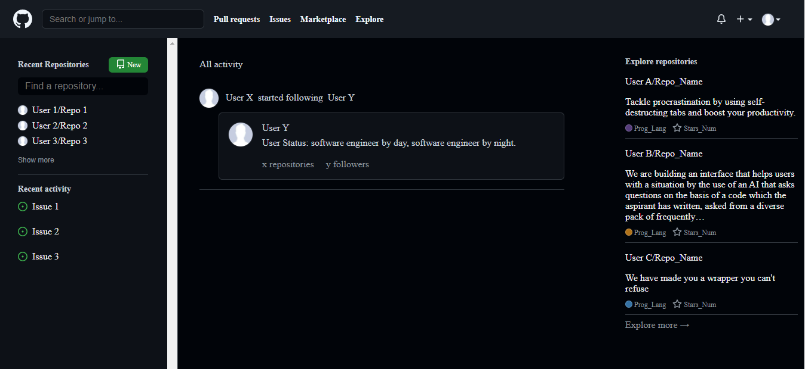

# GitHub Homepage Clone

## Overview

A basic GitHub homepage clone made to demonstrate the capabilities of flex property in CSS and give a breif explanation about how GitHub's frontend is built.

## Tech Stack

- [x] HTML
- [x] CSS

## Screenshot
