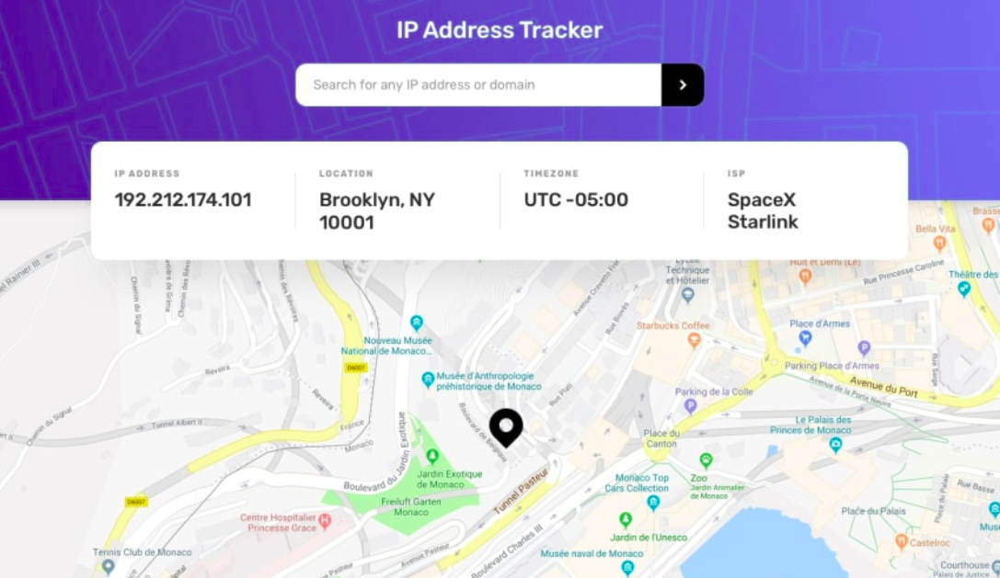

# IPAddressTracker- GSsoc 22 

A project where you can track the IP address of your location and searched for various locations based on IP addresses. Its helpful for tracking.

# Start Website

Download zip or clone the github.

Go To https://dashboard.ipdata.co/ to get your ipdata api 

Go To https://www.mapbox.com/ to get your map access token

  
