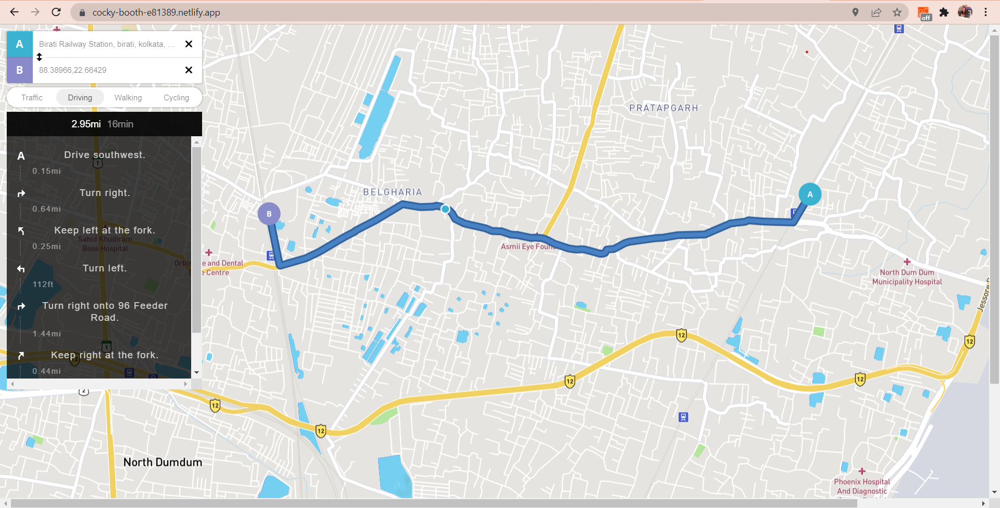

# Maps
A google map clone

# Description
A  map  showing distances between two entered destinations by various modes like google maps.

# Start Website
Download zip or clone the github.
Go To https://www.mapbox.com/maps/ to get your map access token
To start the website generate your own access token from to url given and add to the js file.

# Hosted Link
https://eloquent-roentgen-1a1a4f.netlify.app/

# Screenshot

